# Data Flow Diagrams

## System‑Wide Data Flow

### Overview Flow
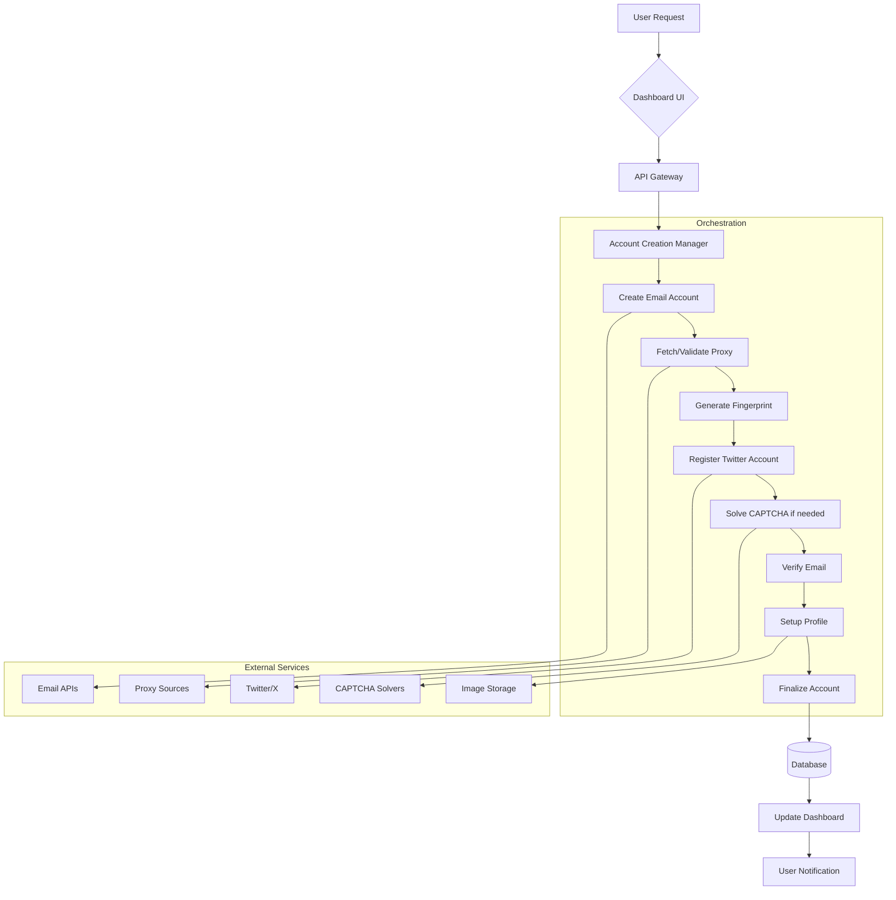

## Component‑Level Data Flows

### 1. Email Account Creation Flow
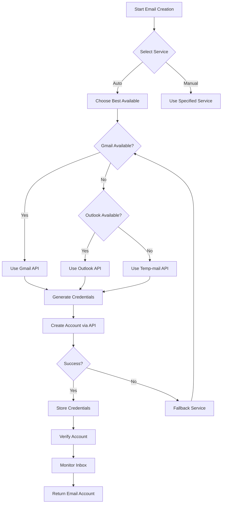

### 2. Proxy Acquisition & Validation Flow
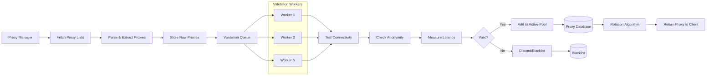

### 3. Device Fingerprint Generation Flow
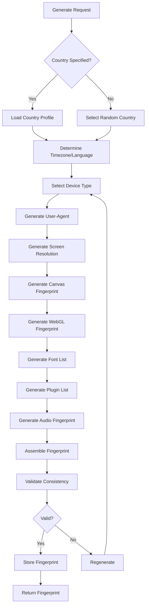

### 4. Twitter Account Registration Flow
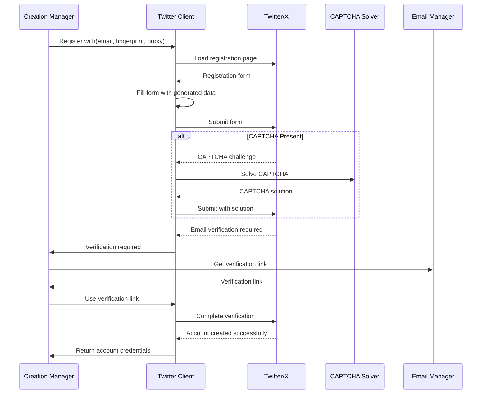

### 5. CAPTCHA Solving Flow
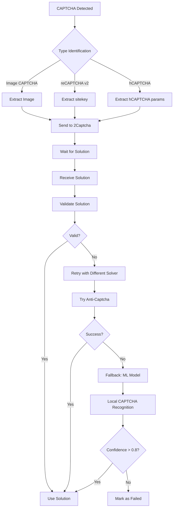

### 6. Profile Setup Flow
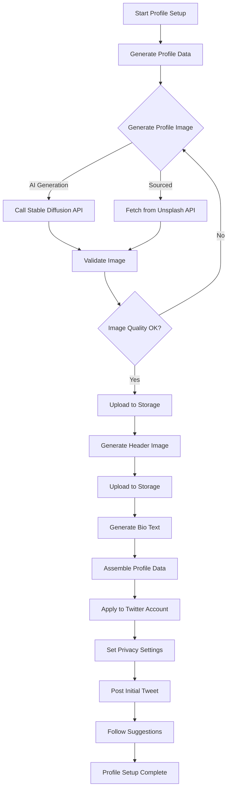

## Error Handling & Retry Flow

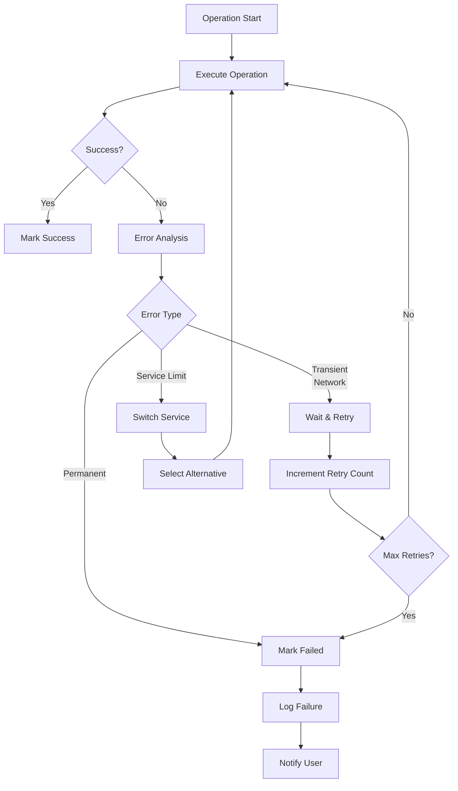

## Data Storage Flow

### Account Data Persistence
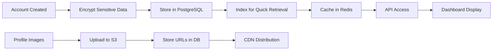

### Proxy Data Lifecycle
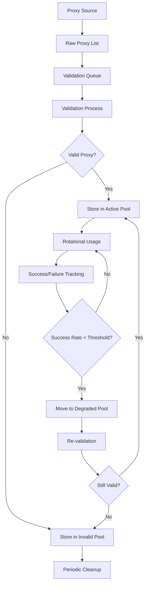

## Real‑Time Monitoring Flow

### Dashboard Updates
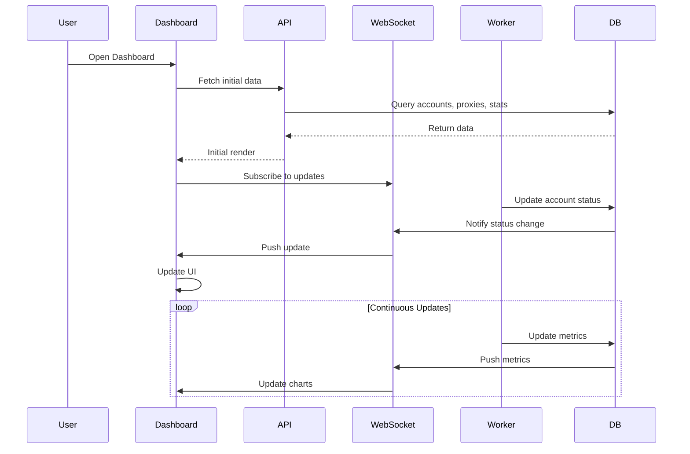

## Batch Processing Flow

### Mass Account Creation
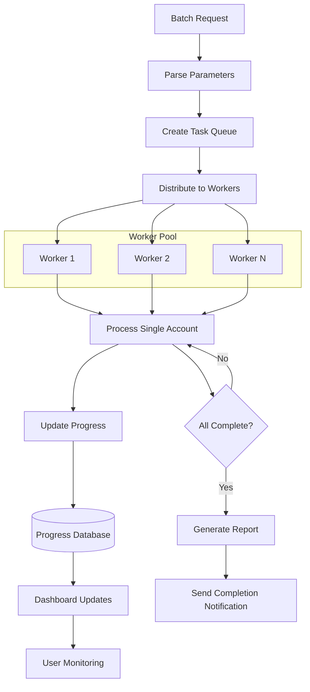

## Security Data Flow

### Credential Handling
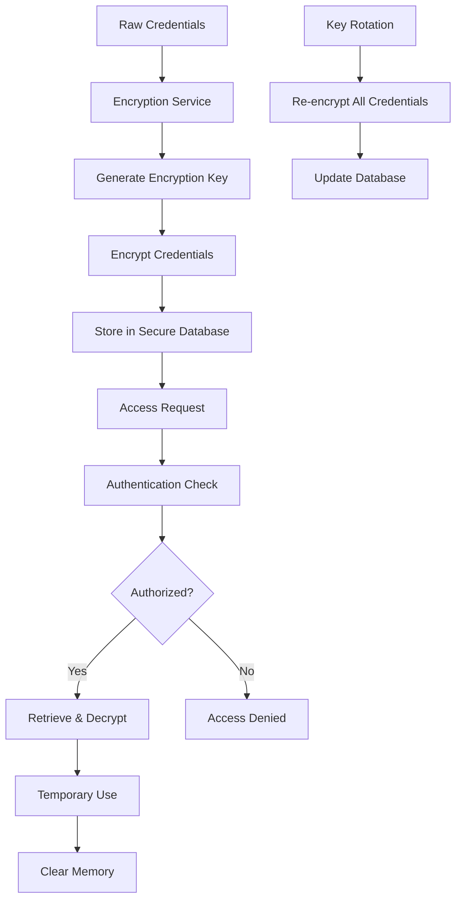

## Integration Points Data Flow

### External APIs Integration
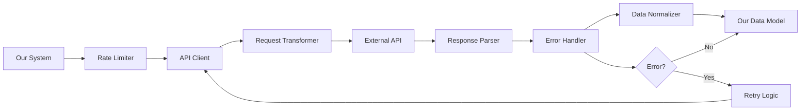

These data flow diagrams illustrate how information moves through the system, highlighting critical integration points, error handling pathways, and data transformation steps. Each diagram corresponds to a major system component and shows the sequence of operations required to accomplish specific tasks within the automated Twitter account creation system.