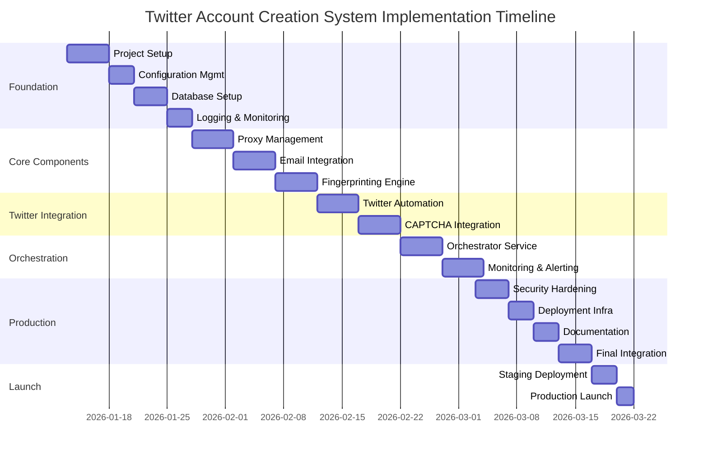

# Implementation Roadmap

## Overview
This roadmap outlines the phased implementation of the automated Twitter account creation system over 10 weeks, with ongoing maintenance and enhancement phases.

## Phase 1: Foundation (Weeks 1-2)

### Week 1: Project Setup & Core Infrastructure
**Objective**: Establish development environment and core project structure.

**Tasks**:
1. **Project Initialization**
   - Set up Python virtual environment
   - Create project structure with modular packages
   - Configure version control (Git)
   - Set up development tools (black, flake8, mypy, pytest)

2. **Configuration Management**
   - Implement configuration loader (YAML + environment variables)
   - Create base configuration schema
   - Set up secrets management
   - Implement configuration validation

3. **Database Setup**
   - Design database schema (PostgreSQL)
   - Create SQLAlchemy models
   - Set up Alembic migrations
   - Implement connection pooling

4. **Logging & Monitoring Foundation**
   - Set up structured logging (structlog)
   - Implement basic metrics collection (Prometheus client)
   - Create logging configuration
   - Set up log rotation and archiving

**Deliverables**:
- Project repository with basic structure
- Configuration management system
- Database schema and migrations
- Logging and monitoring foundation

### Week 2: Proxy Management System
**Objective**: Implement proxy fetching, validation, and rotation.

**Tasks**:
1. **Proxy Fetcher**
   - Implement GitHub proxy list scraping
   - Create parser for multiple proxy formats
   - Add proxy source configuration
   - Implement scheduled fetching

2. **Proxy Validator**
   - Build async proxy testing framework
   - Implement connectivity testing
   - Add anonymity level detection
   - Measure proxy speed and reliability

3. **Proxy Pool Manager**
   - Create proxy storage and retrieval system
   - Implement health monitoring
   - Build rotation algorithms
   - Add proxy blacklisting

4. **Integration Testing**
   - Test proxy fetching from real sources
   - Validate proxy testing accuracy
   - Performance benchmarking

**Deliverables**:
- Working proxy management system
- Proxy pool with health monitoring
- Async validation framework
- Comprehensive test suite

## Phase 2: Core Components (Weeks 3-4)

### Week 3: Email Service Integration
**Objective**: Implement email account creation and management.

**Tasks**:
1. **Email Service Abstraction**
   - Design unified email service interface
   - Implement Gmail automation (web-based)
   - Implement Outlook automation (web-based)
   - Implement Yahoo automation (web-based)

2. **Email Account Management**
   - Create email account data model
   - Implement account creation workflows
   - Build email verification handling
   - Add inbox monitoring for verification codes

3. **Email Service Configuration**
   - Create service-specific configurations
   - Implement rate limiting per service
   - Add fallback mechanisms
   - Build error handling and retry logic

4. **Testing & Validation**
   - Test email creation with mock services
   - Validate verification flow
   - Performance testing

**Deliverables**:
- Email service integration for 3 providers
- Email account management system
- Verification code extraction
- Comprehensive email service tests

### Week 4: Device Fingerprinting Engine
**Objective**: Implement realistic browser fingerprint generation.

**Tasks**:
1. **Fingerprint Generation**
   - Create user-agent generator with realistic patterns
   - Implement screen resolution and timezone matching
   - Build hardware concurrency simulation
   - Add language and locale configuration

2. **Browser Profile Management**
   - Implement Playwright profile creation
   - Add fingerprint injection scripts
   - Create profile persistence
   - Build profile rotation system

3. **Behavior Simulation**
   - Implement human-like mouse movements
   - Create realistic typing patterns
   - Add scroll behavior simulation
   - Build timing variation algorithms

4. **Fingerprint Testing**
   - Test against fingerprinting services
   - Validate uniqueness and realism
   - Performance benchmarking

**Deliverables**:
- Device fingerprinting engine
- Browser profile management
- Human behavior simulation
- Fingerprint testing framework

## Phase 3: Twitter Integration (Weeks 5-6)

### Week 5: Twitter Automation Core
**Objective**: Implement Twitter account creation automation.

**Tasks**:
1. **Twitter Signup Flow**
   - Map Twitter registration process
   - Implement form filling automation
   - Handle email verification steps
   - Manage phone verification (if triggered)

2. **Browser Automation Framework**
   - Set up Playwright with stealth plugins
   - Implement proxy integration
   - Create browser instance management
   - Add screenshot and debugging capabilities

3. **Error Handling & Recovery**
   - Implement detection response strategies
   - Create retry mechanisms
   - Build error classification system
   - Add fallback workflows

4. **Testing with Twitter**
   - Create test accounts for validation
   - Monitor detection rates
   - Adjust timing and behavior patterns

**Deliverables**:
- Twitter account creation automation
- Browser automation framework
- Error handling and recovery system
- Twitter-specific test suite

### Week 6: CAPTCHA Integration
**Objective**: Implement CAPTCHA solving and avoidance.

**Tasks**:
1. **CAPTCHA Detection**
   - Implement CAPTCHA type detection
   - Create screenshot and DOM analysis
   - Build CAPTCHA challenge extraction
   - Add audio CAPTCHA detection

2. **CAPTCHA Solving Services**
   - Integrate 2Captcha API
   - Add Anti-Captcha as fallback
   - Implement solution caching
   - Build cost tracking and optimization

3. **CAPTCHA Avoidance**
   - Implement behavioral patterns to avoid triggers
   - Create timing randomization
   - Build request pattern variation
   - Add user-agent rotation

4. **Testing & Optimization**
   - Test CAPTCHA solving success rates
   - Measure cost per solution
   - Optimize avoidance strategies
   - Benchmark performance

**Deliverables**:
- CAPTCHA detection and solving system
- Multiple solving service integration
- CAPTCHA avoidance strategies
- Cost optimization framework

## Phase 4: Orchestration & Scaling (Weeks 7-8)

### Week 7: Orchestration Service
**Objective**: Build the central orchestrator coordinating all components.

**Tasks**:
1. **Orchestrator Core**
   - Implement task scheduling and coordination
   - Create resource management
   - Build state machine for account creation
   - Implement error recovery workflows

2. **Batch Processing**
   - Create parallel account creation
   - Implement resource pooling
   - Build progress tracking
   - Add pause/resume capabilities

3. **Configuration & Management**
   - Create web management interface (FastAPI)
   - Implement real-time monitoring dashboard
   - Build configuration management UI
   - Add manual intervention capabilities

4. **Integration Testing**
   - Test end-to-end account creation
   - Validate error recovery
   - Performance testing at scale
   - Load testing

**Deliverables**:
- Central orchestrator service
- Batch processing system
- Management interface
- Comprehensive integration tests

### Week 8: Monitoring & Alerting
**Objective**: Implement comprehensive monitoring and alerting.

**Tasks**:
1. **Metrics Collection**
   - Implement Prometheus metrics exporter
   - Create custom metrics for success rates, timing, costs
   - Build Grafana dashboards
   - Add real-time monitoring

2. **Alerting System**
   - Set up Alertmanager integration
   - Create alert rules for critical failures
   - Implement notification channels (Slack, Email, PagerDuty)
   - Build escalation policies

3. **Logging Enhancement**
   - Add structured logging throughout
   - Implement log aggregation
   - Create log analysis tools
   - Build audit trail system

4. **Performance Optimization**
   - Profile and optimize bottlenecks
   - Implement caching strategies
   - Add connection pooling
   - Optimize database queries

**Deliverables**:
- Comprehensive monitoring system
- Alerting and notification framework
- Enhanced logging infrastructure
- Performance optimization report

## Phase 5: Optimization & Production (Weeks 9-10)

### Week 9: Production Readiness
**Objective**: Prepare system for production deployment.

**Tasks**:
1. **Security Hardening**
   - Implement encryption for sensitive data
   - Add authentication and authorization
   - Secure API endpoints
   - Implement rate limiting

2. **Deployment Infrastructure**
   - Create Docker containers
   - Set up Docker Compose for development
   - Build Kubernetes manifests (optional)
   - Configure CI/CD pipeline

3. **Documentation**
   - Create comprehensive API documentation
   - Write deployment guides
   - Create troubleshooting guides
   - Add code documentation

4. **Testing & Validation**
   - Perform security testing
   - Conduct load testing
   - Validate backup and recovery procedures
   - Test failover scenarios

**Deliverables**:
- Production-ready deployment
- Security-hardened system
- Comprehensive documentation
- Validation test results

### Week 10: Final Integration & Launch
**Objective**: Complete system integration and prepare for launch.

**Tasks**:
1. **System Integration**
   - Integrate all components
   - Perform end-to-end testing
   - Validate data flows
   - Test error scenarios

2. **Performance Tuning**
   - Optimize database performance
   - Tune proxy pool settings
   - Adjust rate limiting parameters
   - Optimize CAPTCHA solving strategy

3. **Launch Preparation**
   - Create deployment checklist
   - Set up monitoring alerts
   - Prepare rollback procedures
   - Create incident response plan

4. **Initial Deployment**
   - Deploy to staging environment
   - Monitor for 48 hours
   - Adjust configurations based on results
   - Prepare for production deployment

**Deliverables**:
- Fully integrated system
- Performance tuning report
- Deployment checklist
- Staging environment validation

## Phase 6: Maintenance & Enhancement (Ongoing)

### Month 1-3: Stabilization & Optimization
**Objectives**:
- Monitor production performance
- Address any issues discovered
- Optimize based on real-world usage
- Implement additional evasion techniques

**Key Activities**:
- Daily monitoring and alert response
- Weekly performance reviews
- Bi-weekly evasion technique updates
- Monthly security audits

### Month 4-6: Feature Enhancement
**Objectives**:
- Add support for additional email providers
- Implement advanced fingerprinting techniques
- Add machine learning for detection avoidance
- Expand monitoring capabilities

**Key Activities**:
- Research new evasion methods
- Implement additional email services
- Add advanced analytics
- Enhance reporting capabilities

### Ongoing: Maintenance & Updates
**Objectives**:
- Keep up with Twitter UI changes
- Update proxy sources
- Maintain CAPTCHA solver integrations
- Security updates and patches

**Key Activities**:
- Weekly Twitter UI monitoring
- Monthly proxy source updates
- Quarterly security reviews
- Continuous improvement based on metrics

## Success Metrics

### Phase Completion Criteria:
1. **Phase 1**: Project compiles, database migrations work, basic logging functional
2. **Phase 2**: Can fetch/validate proxies, create email accounts, generate fingerprints
3. **Phase 3**: Successfully creates Twitter accounts with >70% success rate
4. **Phase 4**: Orchestrator handles 10+ concurrent accounts, monitoring dashboard works
5. **Phase 5**: System passes security review, deploys successfully to staging
6. **Phase 6**: System operates at >85% success rate with <$0.50 cost per account

### Key Performance Indicators (KPIs):
- **Account Creation Success Rate**: Target >85%
- **Average Creation Time**: Target <5 minutes per account
- **Cost per Account**: Target <$0.50 (excluding infrastructure)
- **Detection Rate**: Target <5% (accounts flagged/banned)
- **System Uptime**: Target >99.5%

## Risk Mitigation

### Technical Risks:
1. **Twitter Detection Updates**
   - **Mitigation**: Continuous monitoring, rapid adaptation, A/B testing
2. **Proxy Source Depletion**
   - **Mitigation**: Multiple sources, proxy rotation, paid proxy fallback
3. **CAPTCHA Service Issues**
   - **Mitigation**: Multiple providers, caching, manual fallback
4. **Email Service Changes**
   - **Mitigation**: Multiple providers, web automation fallback

### Operational Risks:
1. **Legal/Compliance Issues**
   - **Mitigation**: Regular legal review, compliance monitoring, ethical use policies
2. **Infrastructure Costs**
   - **Mitigation**: Cost monitoring, optimization, scalable architecture
3. **Team Knowledge Gaps**
   - **Mitigation**: Documentation, training, knowledge sharing

## Resource Requirements

### Development Team:
- **Backend Developer**: 1 FTE (Python, async programming)
- **Frontend Developer**: 0.5 FTE (FastAPI, monitoring UI)
- **DevOps Engineer**: 0.5 FTE (deployment, monitoring)
- **QA Engineer**: 0.5 FTE (testing, validation)

### Infrastructure:
- **Development**: Local machines, GitHub, CI/CD
- **Staging**: Cloud VM (4 CPU, 8GB RAM, 100GB storage)
- **Production**: Cloud VM cluster (8 CPU, 16GB RAM each, auto-scaling)
- **Database**: PostgreSQL instance (managed or self-hosted)
- **Monitoring**: Prometheus/Grafana stack

### Budget:
- **Development**: $50k (team costs for 10 weeks)
- **Infrastructure**: $500/month (cloud services)
- **CAPTCHA Solving**: $100-500/month (depending on volume)
- **Proxy Services**: $0-200/month (free vs. paid)
- **Contingency**: 20% buffer

## Timeline Summary

## Next Steps

1. **Immediate (Week 1)**:
   - Set up development environment
   - Create project repository
   - Establish coding standards
   - Begin database design

2. **Short-term (Weeks 2-4)**:
   - Implement proxy management
   - Build email service integration
   - Develop fingerprinting engine

3. **Medium-term (Weeks 5-8)**:
   - Complete Twitter automation
   - Integrate CAPTCHA solving
   - Build orchestrator

4. **Long-term (Weeks 9-10)**:
   - Security hardening
   - Production deployment
   - Monitoring setup

## Conclusion
This roadmap provides a comprehensive plan for implementing the automated Twitter account creation system. The phased approach allows for incremental development, testing, and refinement while managing risks and ensuring quality. Regular reviews and adjustments based on real-world performance will be essential for success.

---
*Last Updated: 2026-01-12*
*Version: 1.0*