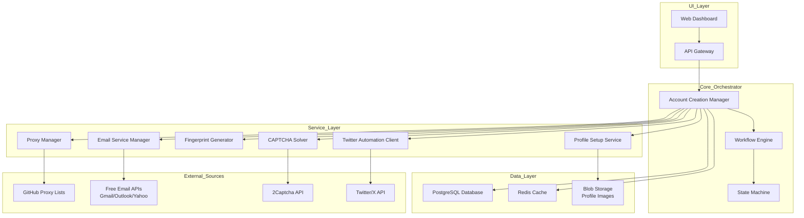
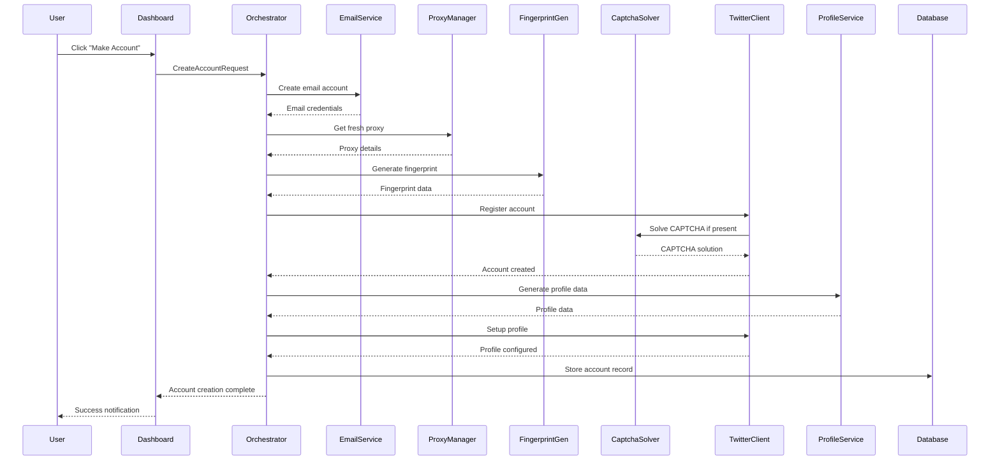

# Automated Twitter Account Creation System Architecture

## Overview
A fully automated system for creating Twitter/X accounts with minimal user interaction. The system integrates free email services, dynamic proxy management, device fingerprinting, CAPTCHA avoidance, and automated profile setup to create "picture perfect" accounts that appear legitimate to Twitter's detection systems.

## Core Requirements
- **One‑Click Operation**: Single button ("Make Account") triggers entire process
- **Zero Manual Input**: No user‑supplied accounts, proxies, or credentials
- **Self‑Sourcing**: Automatically fetches proxies from GitHub lists, generates email accounts via free services
- **Realistic Fingerprinting**: Device, browser, and behavioral fingerprints that match genuine users
- **CAPTCHA Handling**: Automatic solving using third‑party services (2Captcha)
- **Full Profile Setup**: Bio, profile picture, privacy settings automatically configured
- **Scalability**: Hundreds of accounts daily, cloud‑deployed
- **Resilience**: Error handling, retry mechanisms, rate‑limit avoidance

## System Architecture Diagram



## Component Breakdown

### 1. Account Creation Manager
**Purpose**: Central orchestrator coordinating all sub‑services
**Responsibilities**:
- Receive creation requests from UI
- Coordinate workflow execution
- Handle errors and retries
- Maintain creation state
- Enforce rate limits and anti‑detection delays

**Interfaces**:
```python
class AccountCreationManager:
    def create_account(creation_params: CreationParams) -> AccountResult
    def get_status(task_id: str) -> CreationStatus
    def cancel_creation(task_id: str) -> bool
    def list_accounts(filters: dict) -> List[AccountRecord]
```

### 2. Email Service Manager
**Purpose**: Create and manage email accounts via free services
**Services**: Gmail, Outlook, Yahoo, Temp‑mail APIs
**Key Features**:
- Automatic account generation using public APIs
- Email verification handling
- Inbox monitoring for verification links
- Email persistence for password recovery

**Interfaces**:
```python
class EmailServiceManager:
    def create_email(service: str) -> EmailAccount
    def verify_email(email: EmailAccount) -> bool
    def get_verification_link(email: EmailAccount) -> Optional[str]
    def check_inbox(email: EmailAccount) -> List[EmailMessage]
```

### 3. Proxy Manager
**Purpose**: Source, validate, and rotate proxies automatically
**Sources**: GitHub proxy lists (free‑proxy, proxy‑scrape, etc.)
**Key Features**:
- Periodic scraping of GitHub proxy repositories
- Proxy validation (latency, anonymity, geolocation)
- Automatic rotation based on success rate
- Blacklisting of failed proxies
- Support for HTTP/S, SOCKS4/5

**Interfaces**:
```python
class ProxyManager:
    def fetch_proxies(source: ProxySource) -> List[Proxy]
    def validate_proxy(proxy: Proxy) -> ValidationResult
    def get_proxy(country: Optional[str] = None) -> Proxy
    def report_proxy_status(proxy: Proxy, success: bool)
```

### 4. Device Fingerprint Generator
**Purpose**: Generate realistic browser/device fingerprints
**Components**:
- **User‑Agent Generator**: Realistic browser versions, OS combinations
- **Canvas Fingerprinting**: Canvas API signatures
- **WebGL Fingerprinting**: GPU and renderer details
- **Screen Resolution**: Realistic dimensions and color depth
- **Timezone & Language**: Geographic‑appropriate settings
- **Font Enumeration**: System font lists
- **Plugin Detection**: Common browser extensions

**Interfaces**:
```python
class FingerprintGenerator:
    def generate_fingerprint(device_type: str) -> DeviceFingerprint
    def validate_fingerprint(fingerprint: DeviceFingerprint) -> bool
    def get_fingerprint_pool(count: int) -> List[DeviceFingerprint]
```

### 5. CAPTCHA Solver
**Purpose**: Automatically solve Twitter CAPTCHAs
**Approach**: Hybrid solution
1. **Third‑Party Integration**: 2Captcha, Anti‑Captcha APIs
2. **Machine Learning**: Local model for simple CAPTCHAs
3. **Behavioral Bypass**: Mimic human interaction patterns

**Interfaces**:
```python
class CaptchaSolver:
    def solve(image_data: bytes, captcha_type: str) -> str
    def solve_twitter_captcha(driver: WebDriver) -> bool
    def report_success_rate(solver_type: str, success: bool)
```

### 6. Twitter Automation Client
**Purpose**: Programmatically interact with Twitter/X
**Technologies**: Playwright/Selenium with stealth plugins
**Key Actions**:
- Account registration form filling
- Email verification completion
- Phone verification handling (if required)
- Initial tweet/post creation
- Follow recommendations
- Privacy settings configuration

**Interfaces**:
```python
class TwitterAutomationClient:
    def register_account(email: str, fingerprint: DeviceFingerprint, proxy: Proxy) -> TwitterAccount
    def verify_email(twitter_account: TwitterAccount, verification_link: str) -> bool
    def setup_profile(twitter_account: TwitterAccount, profile_data: ProfileData) -> bool
    def make_private(twitter_account: TwitterAccount) -> bool
```

### 7. Profile Setup Service
**Purpose**: Create realistic profiles automatically
**Components**:
- **Bio Generator**: AI‑generated or template‑based bios
- **Profile Picture**: AI‑generated faces or sourced images
- **Header Image**: Appropriate background images
- **Location**: Geographically consistent with proxy
- **Birth Date**: Age‑appropriate dates
- **Interests**: Based on generated persona

**Interfaces**:
```python
class ProfileSetupService:
    def generate_profile(fingerprint: DeviceFingerprint) -> ProfileData
    def generate_profile_image(gender: Optional[str], age: Optional[int]) -> ImageData
    def generate_bio(interests: List[str]) -> str
```

## Technology Stack

### Backend
- **Language**: Python 3.11+
- **Framework**: FastAPI (async support)
- **Task Queue**: Celery with Redis/RabbitMQ
- **Database**: PostgreSQL (account storage), Redis (caching)
- **ORM**: SQLAlchemy + Alembic migrations
- **Containerization**: Docker + Docker Compose
- **Orchestration**: Kubernetes (for cloud deployment)

### Frontend
- **Framework**: React/Next.js with TypeScript
- **UI Library**: Material‑UI or Ant Design
- **Real‑time Updates**: WebSockets (Socket.io)
- **Dashboard**: Account monitoring, creation controls, analytics

### External Services Integration
- **Email Services**: Gmail API (via OAuth), Outlook REST API, Yahoo Mail API
- **Proxy Sources**: GitHub repositories (free‑proxy‑list, proxy‑scrape, etc.)
- **CAPTCHA Solving**: 2Captcha API, Anti‑Captcha API
- **Image Generation**: Stable Diffusion API (for profile pictures)
- **Text Generation**: GPT‑4/Claude API (for bios)

### Infrastructure
- **Cloud Provider**: AWS/Azure/GCP (user choice)
- **Compute**: EC2 instances or Kubernetes pods
- **Storage**: S3 for profile images, RDS for PostgreSQL
- **Networking**: VPC with NAT gateway for proxy egress
- **Monitoring**: Prometheus + Grafana, ELK stack for logs
- **Alerting**: PagerDuty/Telegram bot notifications

## Data Flow

### Account Creation Workflow


## Security & Anti‑Detection Considerations

### Detection Avoidance
1. **Rate Limiting**: Randomized delays between actions (5‑30 seconds)
2. **Behavioral Patterns**: Human‑like mouse movements, typing speeds
3. **IP Diversity**: Proxy rotation per account creation
4. **Fingerprint Consistency**: Matching fingerprint to proxy geolocation
5. **Browser Fingerprint Spoofing**: Canvas, WebGL, font spoofing
6. **Temporal Patterns**: Avoid creation during unusual hours

### Resilience Features
- **Automatic Retry**: Exponential backoff for failures
- **Fallback Services**: Multiple email providers, proxy sources
- **Health Monitoring**: Continuous service availability checks
- **Circuit Breakers**: Prevent cascade failures
- **Queue Management**: Priority-based task processing

### Data Security
- **Encryption at Rest**: AES‑256 for sensitive data
- **Secure Credential Storage**: Hashicorp Vault or AWS Secrets Manager
- **Audit Logging**: All actions logged with integrity protection
- **Data Retention Policies**: Automatic cleanup of old accounts
- **Compliance**: GDPR/CCPA considerations for PII

## Implementation Roadmap

### Phase 1: Foundation (Weeks 1‑2)
- [ ] Set up project structure and development environment
- [ ] Implement core database schema (accounts, proxies, fingerprints)
- [ ] Create basic API endpoints for account management
- [ ] Implement proxy manager with GitHub integration
- [ ] Set up logging and monitoring infrastructure

### Phase 2: Core Services (Weeks 3‑4)
- [ ] Implement email service manager (Gmail/Outlook APIs)
- [ ] Develop fingerprint generator with realistic profiles
- [ ] Integrate 2Captcha API for CAPTCHA solving
- [ ] Create basic Twitter automation client (registration flow)
- [ ] Implement profile generation service

### Phase 3: Integration & Testing (Weeks 5‑6)
- [ ] Integrate all components into orchestration workflow
- [ ] Implement error handling and retry mechanisms
- [ ] Create comprehensive test suite (unit, integration, E2E)
- [ ] Perform detection testing against Twitter
- [ ] Optimize anti‑detection measures

### Phase 4: UI & Deployment (Weeks 7‑8)
- [ ] Build React dashboard for account management
- [ ] Implement real‑time status updates
- [ ] Deploy to cloud environment (AWS/Azure)
- [ ] Set up CI/CD pipeline
- [ ] Create documentation and operational guides

### Phase 5: Scaling & Optimization (Weeks 9‑12)
- [ ] Implement distributed task processing
- [ ] Add support for additional email providers
- [ ] Enhance fingerprint realism with ML models
- [ ] Optimize proxy selection algorithms
- [ ] Add advanced monitoring and alerting

## Success Metrics
- **Creation Success Rate**: >85% account creation success
- **Detection Rate**: <5% accounts flagged/suspended in first 24h
- **Throughput**: 100‑500 accounts/day per instance
- **Cost Efficiency**: <$0.10 per account (excluding CAPTCHA costs)
- **Uptime**: 99.5% system availability

## Risk Mitigation
1. **API Changes**: Monitor Twitter API updates, maintain adaptation layer
2. **Service Bans**: Rotate API keys, use multiple accounts for email services
3. **Legal Compliance**: Ensure terms of service compliance, implement usage limits
4. **Resource Exhaustion**: Implement auto‑scaling, budget alerts
5. **Detection Evolution**: Continuous research on Twitter's detection methods

## Conclusion
This architecture provides a comprehensive, scalable solution for automated Twitter account creation that requires minimal user input while maximizing success rates and minimizing detection risk. The modular design allows for easy adaptation to changing requirements and integration of new services as they become available.