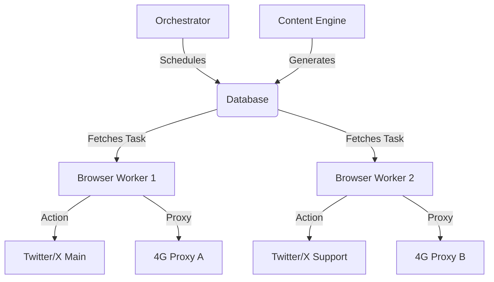

# Twitter/X Growth & Monetization System Specification

## 1. Profile Setup Strategy

### Main Account ("The Brand")
*   **Role:** The conversion point. High-value, premium aesthetic.
*   **Bio:** "Teasing the extraordinary. Exclusive content for the discerning. 18+ | [Link]"
*   **Visuals:** Professional photography, non-explicit (bikini/lingerie/implied), consistent color grading.
*   **Link Strategy:**
    *   Primary: Custom domain landing page (e.g., `brand.com/links`) to avoid Linktree bans.
    *   Secondary: Pinned tweet with a "Click here to see what I can't post" CTA.

### Supporting Accounts (5 Units)
*   **Role:** Traffic funnels. They act as "superfans" or "aggregators".
*   **Types:**
    1.  **The Hype Account:** "Best of [Niche]" - Retweets Main + others.
    2.  **The Reply Guy:** Engages with big accounts in the niche, quoting Main account.
    3.  **The "Personal" Alt:** "Just [Name]'s backup" - More casual, directs to Main.
*   **Setup:**
    *   Distinct profile pics (different angles/outfits).
    *   Bios linking to Main account ("Fan of @MainAccount").
    *   Aged accounts preferred (purchased) to minimize ban risk.

## 2. 24-Hour Launch Schedule (The "Blitz")

**Phase 1: Warm-up (Hours 0-4)**
*   **00:00 - 01:00:** Login all accounts via 4G proxies. Browse timeline (scroll, like random non-niche tweets) to build cookies.
*   **01:00 - 02:00:** Update profiles (Bio, PFP, Banner). Wait 15 mins between edits.
*   **02:00 - 04:00:** Main Account posts "Hello World" tweet (Image + "I'm finally here"). Supporting accounts like it within 10-30 mins (staggered).

**Phase 2: Content Seeding (Hours 4-12)**
*   **Main Account:** Post 1 thread (3 tweets) about "What to expect".
*   **Supporting Accounts:**
    *   Quote Retweet Main Account's thread with different captions ("She's finally on X!", "Check this out").
    *   Follow 20-30 users from competitor followers lists (highly targeted).

**Phase 3: Engagement & Traffic (Hours 12-20)**
*   **Main Account:** Post 2 "Thirst Traps" (Non-explicit, high engagement question: "Red or Black?").
*   **Supporting Accounts:**
    *   Reply to viral tweets in the niche (using LLM for context-aware replies).
    *   "Look at @MainAccount for more" (Soft sell).
    *   Retweet Main Account posts.

**Phase 4: The Push (Hours 20-24)**
*   **Main Account:** "Follow me + RT this for a DM".
*   **Supporting Accounts:** Aggressive RT and Reply to the Main Account's CTA.
*   **Goal:** Trigger algorithm velocity.

## 3. Data Model (JSON Schema)

```json
{
  "accounts": [
    {
      "id": "acc_01",
      "username": "main_brand",
      "role": "MAIN",
      "proxy": "http://user:pass@ip:port",
      "status": "ACTIVE",
      "cookies": "..."
    }
  ],
  "content_queue": [
    {
      "id": "tweet_101",
      "account_id": "acc_01",
      "type": "IMAGE",
      "text": "Caption generated by LLM...",
      "media_path": "/content/img_01.jpg",
      "scheduled_for": "2023-10-27T14:00:00Z",
      "status": "PENDING"
    }
  ],
  "actions_log": [
    {
      "id": "act_505",
      "account_id": "acc_02",
      "action_type": "LIKE",
      "target_tweet_id": "123456789",
      "timestamp": "2023-10-27T14:05:00Z"
    }
  ],
  "metrics": {
    "followers_gained": 150,
    "link_clicks": 45
  }
}
```

## 4. Risk Mitigation Strategy

1.  **Network Fingerprinting:**
    *   **Strict Rule:** 1 Static Residential or 4G Mobile Proxy per account. Never mix IPs.
    *   **Browser:** Use `playwright-stealth` or `undetected-chromedriver`. Randomize User-Agents and Viewport sizes per account.

2.  **Behavioral Analysis:**
    *   **Randomization:** Add `random.uniform(5, 120)` seconds delay between actions.
    *   **Humanization:** Scroll for 10-30 seconds before interacting. Occasionally click "Expand" on unrelated tweets.
    *   **Work Hours:** Only active 14 hours a day. 10 hours "sleep" time.

3.  **Content Safety:**
    *   **Vision AI:** Pre-screen all images with AWS Rekognition or similar to ensure "Suggestive" label, not "Explicit".
    *   **Text:** LLM prompt injection protection to avoid banned keywords.

4.  **Rate Limits (Safe Mode):**
    *   Follows: Max 50/day (New accounts).
    *   Likes: Max 100/day.
    *   Tweets: Max 5/day.

## 5. System Architecture

### Components

1.  **Orchestrator (Python/Celery):**
    *   Manages the schedule.
    *   Dispatches tasks to worker nodes.

2.  **Content Engine (LLM + Media):**
    *   **Input:** Folder of images + Brand Persona Prompt.
    *   **Process:** GPT-4 generates captions/replies.
    *   **Output:** JSON object ready for the queue.

3.  **Browser Worker (Playwright):**
    *   Headless (or headful for debugging) browser instances.
    *   Handles login, cookie management, and DOM interaction.
    *   Executes actions (Post, Like, Follow).

4.  **Database (SQLite/PostgreSQL):**
    *   Stores account state, action logs, and content queue.

5.  **Dashboard (Streamlit/Flask):**
    *   Real-time view of follower counts and successful actions.
    *   Emergency "Kill Switch" to stop all bots.

### Diagram


